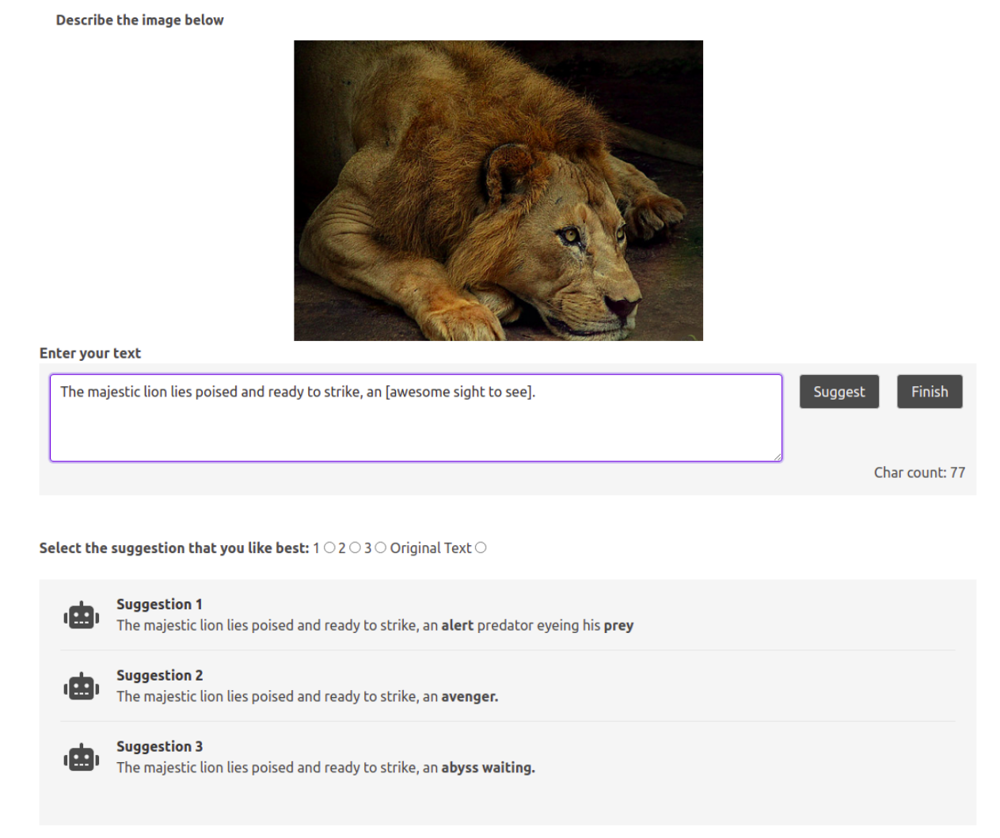

## Work in progress

## Web Interface

1. Code for UI used for MTurk experiments. The code is based on Parlai and consumes a trained Fairseq BART model. 
2. Once you host the same on your server, the server code expects the images in the directory Image-Source and shows the user the image indexed by the URL parameter. Model index of 0 is the trained model consumed and model index of 1 is BART baseline. We used the above URL parameters to control the experiment to obtain two captions for each image The expected URL is of the form: 
```
https://<server domain>:<port number>?model=<model idx>&idx=<image idx>
```
3. The backend where you host the server also needs a GPU since it runs an inference for every interaction.
4. Once an interaction is complete, the results are saved in a pickle file indexed by a generated UID. We collect the UID in MTurk and correspond it to the results.
5. Image of interface in practise:


## Run command

```
python3 interactive_web.py --model bart --init-fairseq-model /path/to/fairseq/checkpoint_best.pt --inference topk --host 0.0.0.0 --port 12000
```
